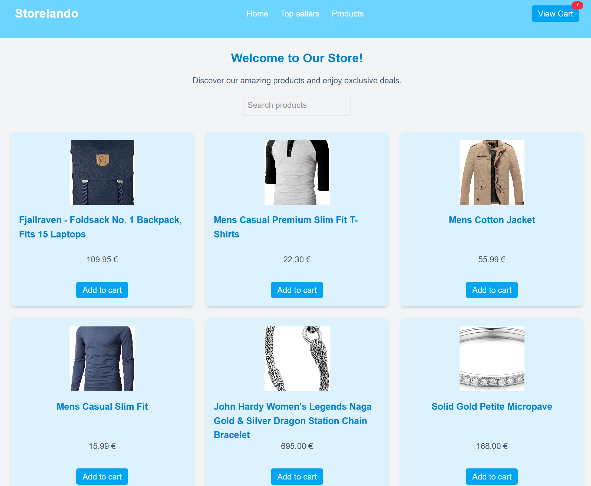
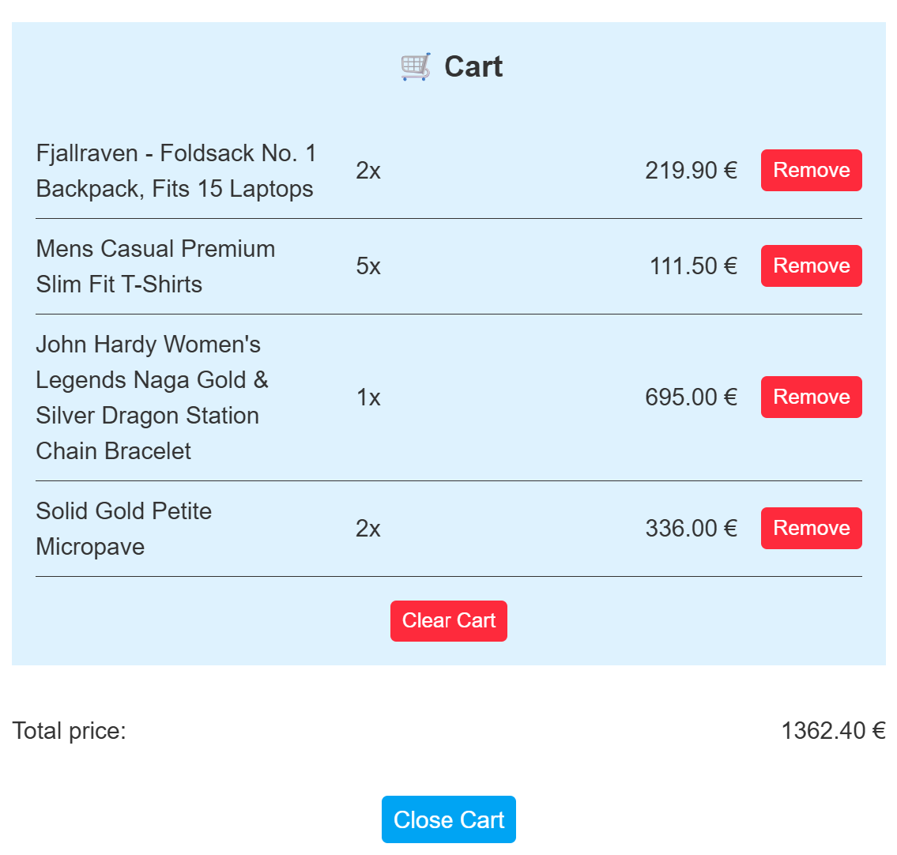
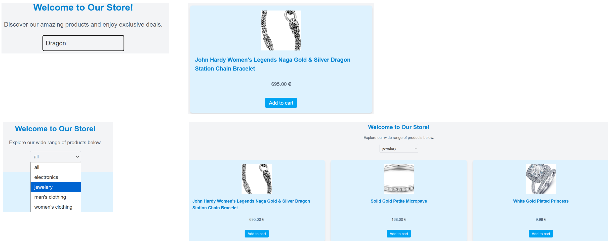

## Ecommerce

## About the project

This React project (SPA) was created and completed as an assignment during a Full Stack Web Development Bootcamp at [ReDI School of Digital Integration] (https://www.redi-school.org/) in April 2025.

### Stack

React, Vite, Tailwind

### Main learnings

Setting Up Routing with React Router
(Installing react-router-dom)

Fetching Product Data from an API
(Using Fake Store API to load product data dynamically)

Searching for a product and Filtering

Creating a Dynamic Product Page
(Using React Router Params to load product details dynamically)

Managing State for the Cart
(Products added to the cart remain accessible throughout the app)

Implement Global State Management with Context API
(Defining a Cart Context that manages the cart items and provides functions to add or remove products)

Implementing Error Handling in API Requests
(Improving our fetch logic by handling API errors)

Using an Error Boundary
(React Error Boundaries allow to catch runtime errors and display a fallback UI instead of crashing the entire app)

### images

